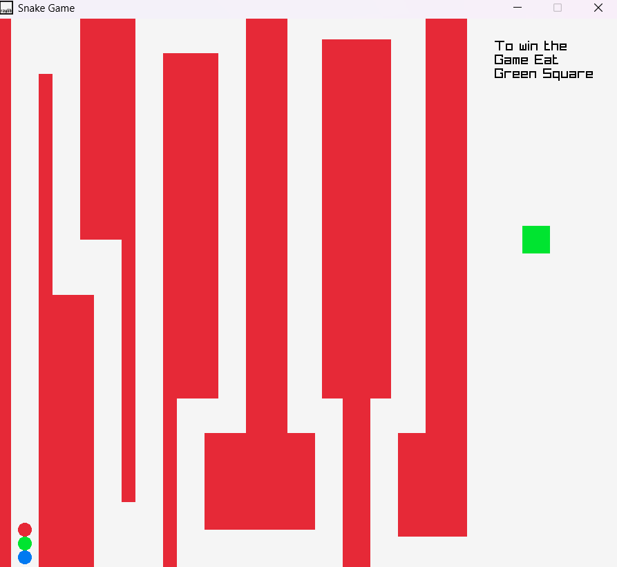

# Snake_Game
🐍 Classic Snake Game implemented in C using raylib, a simple and easy-to-use library to enjoy game programming.

# 🐍 Snake Maze Game (C + raylib)

A simple yet engaging Snake Maze Game built using **C** and the **[raylib](https://www.raylib.com/)** graphics library.

The objective is clear:  
> **Navigate the snake through the red maze and eat the green square to win!**

---

## 🧠 Game Objective

- 🟥 Avoid red walls (they are obstacles).
- 🟩 Reach and eat the green square to win.
- 🟢🔵🔴 Dots represent the snake.

---

## 🎮 Controls

- **Arrow Keys**: Move Up, Down, Left, Right  

---

## 🛠️ Built With

- **C programming language**
- **[raylib.h](https://www.raylib.com/)** – a simple and easy-to-use library to learn game programming

---

## 📦 Requirements

Make sure you have the following installed:

- **GCC / Clang compiler**
- **raylib library**
